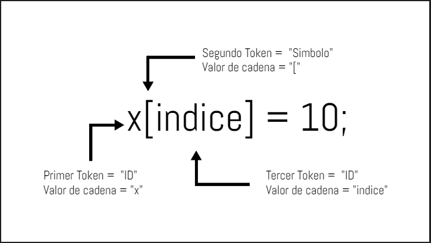

## Contenido de la Sesión
---
### Lenguajes de Programación

#### Lenguaje Máquina
Las computadoras solo entienden el sistema binario {0,1} para ejecutar instrucciones y/o operaciones, esto hace los programas muy eficientes en ejecución y ocupación de memoria, pero es difícil codificar en solo 0 y 1 para los seres humanos.

#### Lenguaje Ensamblador
Lenguaje que utiliza un conjunto de símbolos conocidos como mnemotécnicas, intento sustituir al lenguaje máquina para mayor facilidad de uso para las personas. Sin embargo, tiene un repertorio reducido de instrucciones y un formato rígido. Se utilizaba un ensamblador para traducir al lenguaje máquina.

#### Lenguaje de Alto Nivel
Lenguaje cercano al programador para mayor facilidad para desarrollar aplicaciones independientes al de la máquina. Utilizan instrucciones más fáciles de entender. Sin embargo, al ser más cercano al lenguaje humano se aleja mucho al de la maquina; por ende, era necesario crear un traductor para transformar al lenguaje máquina.

### Compiladores e Interpretes

Como el computador solo entiende el lenguaje máquina era necesaria un traductor que reciba un programa en lenguaje de alto nivel (código fuente) y de como resultado otro lenguaje (código objeto).

* Compilador : Traduce el código fuente de forma completa a código objeto para su posible ejecución. El código objeto puede ser almacenado en la memoria para ejecutarlo de manera inmediata o más adelante sin volver a traducir el código nuevamente.

* Interprete : Traduce el código fuente línea por línea y lo ejecuta; además no se guarda en memoria para ejecuciones futuras.

#### Tokens
Diversas categorías como palabras reservadas, identificadores, símbolos, etc. Como entidades lógicas se distingue de las cadenas de caracteres que representa (lexema o valor de cadena).

#### Fases de un compilador

* Analizador léxico : Lee el código fuente y agrupa la secuencia de caracteres en tokens.

    *Nota: Los espacios en blanco que separan los caracteres se eliminan. Existen delimitares para indicar el inicio y fin de un token*

* Analizador sintáctico : Ingresa los tokens y se obtiene un árbol sintáctico. Estructura de forma jerárquica el programa en árbol donde los nodos son los tokens. Revisa la sintaxis del lenguaje que sea correcto.

    *Nota: Aquí se toma en cuenta la jerarquía como en la matemática, por ejemplo, primero es la multiplicación, luego la adición.*

* Analizador semántico : Toma el árbol sintáctico y genera un árbol de sintaxis. Comprobación del árbol sintáctico para determinar el correcto significado del programa. Determina si hay algún error semántico por ejemplo sumar un tipo inti con tipo char.

    Verifica el uso de operandos permitidos como el tipo de variables, scope de variables, llamado de funciones, entre otros. Por ejemplo, en una variable declara tipo "entero" no se pueda almacenar una cadena de texto.

* Generador de código intermedio : Representación intermedia del programa fuente que debe tener dos propiedades como su fácil producción y traducción al "código objeto".

    Una forma intermedia es llamada "código de 3 direcciones". Que a lo mucho puede tener un operador y la asignación, 3 operandos a lo mucho por instrucción y nombres temporales para almacenar los resultados.

* Optimizador de código intermedio : Se trata de mejorar el código, en forma de reducir la cantidad de recursos como memoria y tiempo. En algunos casos son pocos los cambios del código como eliminar código inactivo, variables intermedias, entre otros para mejorar la eficiencia del programa.

* Generador de código objeto :
 Traducir lo más cercano posible al lenguaje maquina como el lenguaje ensamblador. Se seleccionan posiciones de memoria relativa o registros para las variables del código intermedio y se traduce.

* Optimizador del código objeto :  Optimización del código objeto eliminando operaciones innecesarias o repetidas, reemplazando instrucciones lentas.