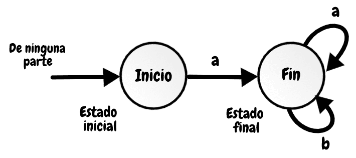
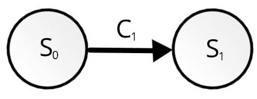
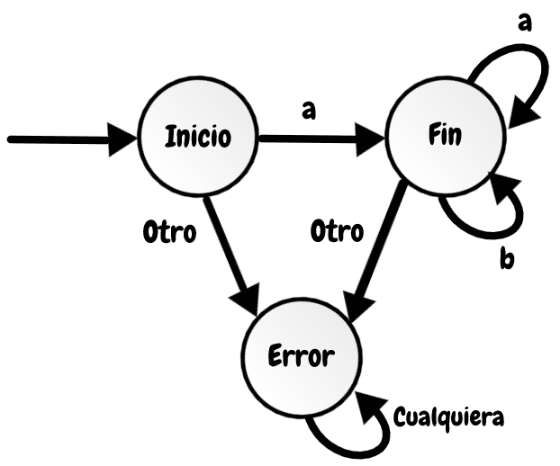
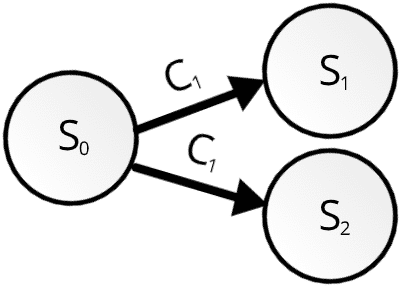

## Autómatas finitos

Se pueden utilizar para describir procesos de reconocimiento de patrones en cadenas de entrada. Si puedo reconocer una cadena será capaz de construir un analizador léxico.

Tenemos el vocabulario **V** y formamos la expresion regular **r** 

V={a, b}    
r= a(a|b)*

Entonces las cadenas que pueden ser formadas y aceptadas por la expresión regular serian a, aa, ab , aaa, aab, entre otros. El gráfico del autómata finito sería el siguiente: 

En la imagen podemos ver que la gráfica consiste de círculos, que llamaremos estados, y flechas, llamada transición. Toda gráfica parte de un estado inicial que proviene de ninguna parte, se cambiará de estado segun los símbolos leidos que forman parte de la cadena ingresada.

Como vemos en la imagen, ingresamos la cadena "a" y el estado inicio se dirige a estado final, porque "a" sí cumple con la expresión regular; debido a que (a|b)* tambien puede tomar el valor de cadena vacia (λ) y como sabemos la unión de cualquier caracter con "λ" siempre es el mismo caracter. En este caso vemos que al ingresar "a" ya cumpliría, pero tambíen puede aceptar cadenas más largas como "aa", "ab" o "aabb", porque estas cadenas también cumplen con la expresion regular, es por eso que al final hay como un bucle de "a" y "b".

Ejemplos    
* aa  
-> inicio -a-> fin -a-> fin  

* abb     
-> inicio -a-> fin -b-> fin -b-> fin   

* baa   
En este caso, no hay cambio de estado, porque la expresión regular indica comenzar con el símbolo "a" pero está comenzando con "b".

### Autómata finito determinístico (AFD)

Son aquellos que pasan a un unico estado por el estado actual y el caracter ingresado. Es decir, hay un solo estado al que se puede ir desde el estado actual por el ingreso de un caracter.

AFD se compone de
1. Un alfabeto "V"
2. Un conjunto de estados S
3. Una función de transición T: SxV -> S
4. Un estado de inicio So ϵ S
5. Un conjunto de entradas de aceptacion A c S

C1 es un caracter del vocabulario "V" 

Transición : Ir de un estado a otro leyendo un caracter.

S1 = (S0, C1)  
S2 = (S1, C2)  
S3 = (S2, C3)  
Un error sería -> S4 = (S2, C3) porque esa transición ya digire al estado S3 y el AFD solo permite ir a **un unico estado**.

#### Estado Error

Tomaremos el primero ejemplo para explicar el estado Error  
Realizamos el producto cartesiano de los estados y vocabulario.
S = {inicio,fin}    
V= {a, b}   
SV = {(inicio,a),(inicio,b),(fin,a),(fin,b)}    

Como podemos observar la transicion (inicio,b) no existe y segun la composición de un AFD (transición T: SxV -> S) para cada transición de un estado y caracter debe haber un estado. Entonces para estos casos y cuando se ingrese un simbolo no valido se utilizara el estado error.

"Otro" indica un símbolo no válido como c, f, e, entre otros, también símbolos que no concuerden con la expresión regular como el caso de la transición {inicio, b} que no dirige a un estado válido; por ende va al estado error, cuando se llega a ese estado ya no se puede salir inclusive si se ingresa símbolos válidos.

* El primer otro puede tomar valores como "b" y símbolos no válidos.
* El segundo otro puede tomar símbolos no válidos.

### Autómata finito no determinístico (AFN)
Lo que diferencia con el anterior es que ahora se acepta el lambda(λ) y que desde el estado actual y el ingreso de un caracter se puede ir a **un o varios estados**.

AFN se compone de
1. Un alfabeto "V" U {λ}
2. Un conjunto de estados S
3. Una función de transición T: SxV -> P(S)
4. Un estado de inicio So ϵ S
5. Un conjunto de entradas de aceptacion A c S

