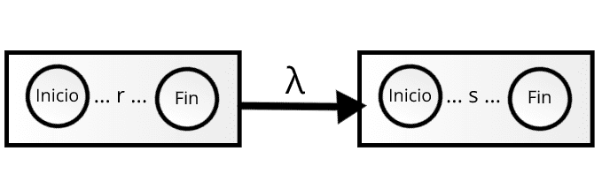
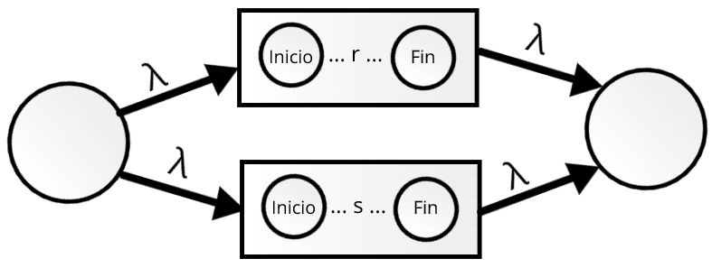
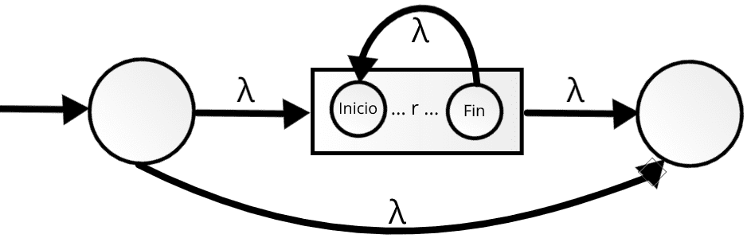
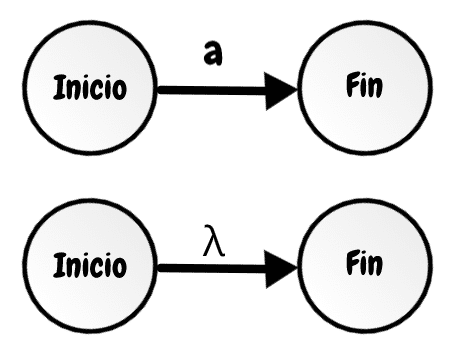

## Construcciones de Thompson

Para continuar con el objetivo de crear un analizador léxico necesitamos utilizar Thompson, pero ¿Cuál es la utilidad de Thompson ?

Para empezar necesitamos transformar una expresión regular a un Autómata finito determinístico(AFD), pero en ocasiones esto suele ser complicado es por eso que antes de ello transformaremos la expresión regular a un Autómata finito no determinístico(AFN) y para eso necesitamos un algoritmo que sea capaz se hacerlo y es aquí donde Thompson de útil.

Las construcciones de Thompson tienen 3 operaciones básicas para transformar una expresion regular a un AFN que son selección, concatenación y repetición.

* Selección      

* Concatenación     

* Repetición        

> Nota: En las imagenes hay rectángulos que representan la forma más basica de transición. Por ejemplo la transición de un estado inicial al estado final por un caracter en este caso "a", los caractares van a depender de la expresión regular, y la cadena vacia "λ".

